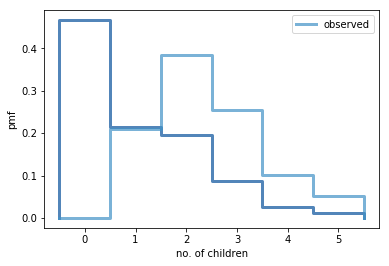

[Think Stats Chapter 3 Exercise 1](http://greenteapress.com/thinkstats2/html/thinkstats2004.html#toc31) (actual vs. biased)

>> In this exercise, we are asked to look at the effect of biased data on its statistical interpretation. The mean of the number of children per respondent’s household is actually 1.0. In fact, for 47% of the women interviewed, their households had 0 children. When we look at the biased data set of asking the children themselves how many kids are in their household, we eliminate all of the households with 0 children. The mean of this biased data set is 2.4 children, which is a big difference compared to the actual data’s mean. Below is the excerpt from the jupyter notebook I used to solve the problem.

___

>> Something like the class size paradox appears if you survey children and ask how many children are in their family. Families with many children are more likely to appear in your sample, and families with no children have no chance to be in the sample.

>> Use the NSFG respondent variable `numkdhh` to construct the actual distribution for the number of children under 18 in the respondents' households.

>> Now compute the biased distribution we would see if we surveyed the children and asked them how many children under 18 (including themselves) are in their household.

>> Plot the actual and biased distributions, and compute their means.


```python
resp = nsfg.ReadFemResp()
```


```python
# plot actual number of children per household
pmf = thinkstats2.Pmf(resp.numkdhh)
thinkplot.Pmf(pmf, label='actual')
thinkplot.Config(xlabel='no. of children', ylabel='pmf')
```


```python
# plot observed number of children per household
biased_pmf = BiasPmf(pmf, 'observed')
thinkplot.Pmf(biased_pmf, label = 'observed')
thinkplot.Config(xlabel='no. of children', ylabel='pmf')
```


```python
# plot actual vs. observed
thinkplot.PrePlot(2)
thinkplot.Pmfs([pmf, biased_pmf])
thinkplot.Config(xlabel = 'no. of children', ylabel='pmf')
```





```python
# Compute the means
print('Actual mean:', pmf.Mean())
print('Observed mean:', biased_pmf.Mean())
```

    Actual mean: 1.02420515504
    Observed mean: 2.40367910066

