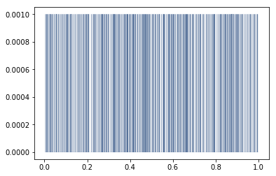
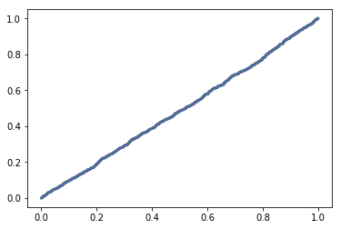

[Think Stats Chapter 4 Exercise 2](http://greenteapress.com/thinkstats2/html/thinkstats2005.html#toc41) (a random distribution)

>> This question asks us to examine whether `numpy.random.random` actually generates uniformly distributed random numbers between 0 and 1. First I plotted the PMF of 1000 randomly generated numbers. It is a bit difficult to see on the PMF because there are a lot of lines and they are very close together, but it appears as if every number has a probability of 1/1000, which would suggest a uniform distribution. Then I plotted the CDF of the numbers, which produced a near-straight line, which means that the distribution is uniform. Below is the excerpt of the jupyter notebook I used to solve the problem.

___

**Exercise:** The numbers generated by `numpy.random.random` are supposed to be uniform between 0 and 1; that is, every value in the range should have the same probability.

Generate 1000 numbers from `numpy.random.random` and plot their PMF.  What goes wrong?

Now plot the CDF. Is the distribution uniform?


```python
numbers = np.random.random(1000)
pmf = thinkstats2.Pmf(numbers)
thinkplot.Pmf(pmf, linewidth = 0.08)
```





```python
cdf = thinkstats2.Cdf(numbers)
thinkplot.Cdf(cdf)
```


    {'xscale': 'linear', 'yscale': 'linear'}


