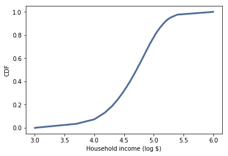
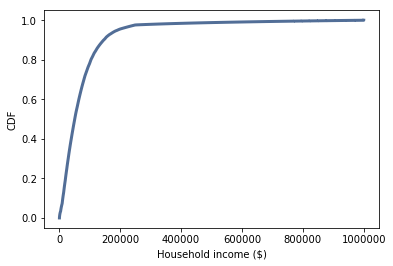
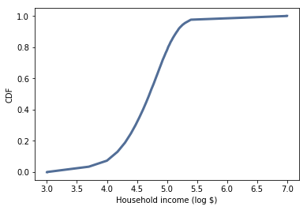
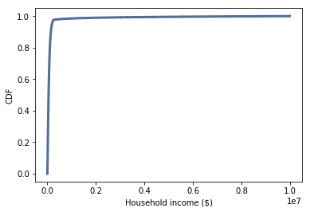

[Think Stats Chapter 6 Exercise 1](http://greenteapress.com/thinkstats2/html/thinkstats2007.html#toc60) (household income)

>> The mean of the income data assuming an upper bound of $1 million is around $74,000, while the median is around $51,000. The fact that the mean is greater than the median suggests a right-skewed distribution. The calculations of skewness are both positive and therefore also indicate right-skewness. The skewness is 4.95 and the Pearson's skewness is 0.74. 

>> The skew changes depending on our assumption for the upper bound. If we change the upper bound to $10 million, the magnitude of the skewness increases. The median stays the same, but the mean goes up to around $124,000. 

>> Below is the code from the jupyter notebook I used to solve the problem.


## Exercises

The distribution of income is famously skewed to the right. In this exercise, we’ll measure how strong that skew is.
The Current Population Survey (CPS) is a joint effort of the Bureau of Labor Statistics and the Census Bureau to study income and related variables. Data collected in 2013 is available from http://www.census.gov/hhes/www/cpstables/032013/hhinc/toc.htm. I downloaded `hinc06.xls`, which is an Excel spreadsheet with information about household income, and converted it to `hinc06.csv`, a CSV file you will find in the repository for this book. You will also find `hinc2.py`, which reads this file and transforms the data.

The dataset is in the form of a series of income ranges and the number of respondents who fell in each range. The lowest range includes respondents who reported annual household income “Under \$5000.” The highest range includes respondents who made “\$250,000 or more.”

To estimate mean and other statistics from these data, we have to make some assumptions about the lower and upper bounds, and how the values are distributed in each range. `hinc2.py` provides `InterpolateSample`, which shows one way to model this data. It takes a `DataFrame` with a column, `income`, that contains the upper bound of each range, and `freq`, which contains the number of respondents in each frame.

It also takes `log_upper`, which is an assumed upper bound on the highest range, expressed in `log10` dollars. The default value, `log_upper=6.0` represents the assumption that the largest income among the respondents is $10^6$, or one million dollars.

`InterpolateSample` generates a pseudo-sample; that is, a sample of household incomes that yields the same number of respondents in each range as the actual data. It assumes that incomes in each range are equally spaced on a `log10` scale.


```python
def InterpolateSample(df, log_upper=6.0):
    """Makes a sample of log10 household income.

    Assumes that log10 income is uniform in each range.

    df: DataFrame with columns income and freq
    log_upper: log10 of the assumed upper bound for the highest range

    returns: NumPy array of log10 household income
    """
    # compute the log10 of the upper bound for each range
    df['log_upper'] = np.log10(df.income)

    # get the lower bounds by shifting the upper bound and filling in
    # the first element
    df['log_lower'] = df.log_upper.shift(1)
    df.loc[0, 'log_lower'] = 3.0

    # plug in a value for the unknown upper bound of the highest range
    df.loc[41, 'log_upper'] = log_upper
    
    # use the freq column to generate the right number of values in
    # each range
    arrays = []
    for _, row in df.iterrows():
        vals = np.linspace(row.log_lower, row.log_upper, row.freq)
        arrays.append(vals)

    # collect the arrays into a single sample
    log_sample = np.concatenate(arrays)
    return log_sample

```


```python
import hinc
income_df = hinc.ReadData()
```


```python
log_sample = InterpolateSample(income_df, log_upper=6.0)
```


```python
log_cdf = thinkstats2.Cdf(log_sample)
thinkplot.Cdf(log_cdf)
thinkplot.Config(xlabel='Household income (log $)',
               ylabel='CDF')
```





```python
sample = np.power(10, log_sample)
```


```python
cdf = thinkstats2.Cdf(sample)
thinkplot.Cdf(cdf)
thinkplot.Config(xlabel='Household income ($)',
               ylabel='CDF')
```





Compute the median, mean, skewness and Pearson’s skewness of the resulting sample. What fraction of households report a taxable income below the mean? How do the results depend on the assumed upper bound?


```python
Mean(sample), Median(sample), Skewness(sample), PearsonMedianSkewness(sample)
```


    (74278.707531187334,
     51226.454478940461,
     4.9499202444295829,
     0.7361258019141782)


```python
cdf.Prob(Mean(sample))
```


    0.66000587956687196


```python
log_10milsample = InterpolateSample(income_df, log_upper=7.0)
log_10milcdf = thinkstats2.Cdf(log_10milsample)
thinkplot.Cdf(log_10milcdf)
thinkplot.Config(xlabel='Household income (log $)',
               ylabel='CDF')
```





```python
tenmilsample = np.power(10, log_10milsample)
cdf = thinkstats2.Cdf(tenmilsample)
thinkplot.Cdf(cdf)
thinkplot.Config(xlabel='Household income ($)',
               ylabel='CDF')
```





All of this is based on an assumption that the highest income is one million dollars, but that's certainly not correct.  What happens to the skew if the upper bound is 10 million?

Without better information about the top of this distribution, we can't say much about the skewness of the distribution.


```python
Mean(tenmilsample), Median(tenmilsample), Skewness(tenmilsample), PearsonMedianSkewness(tenmilsample)
```


    (124267.39722164685,
     51226.454478940461,
     11.603690267537793,
     0.39156450927742087)


