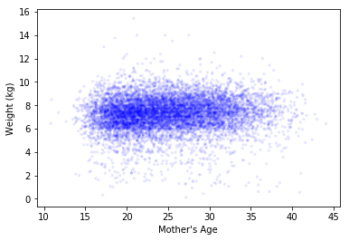
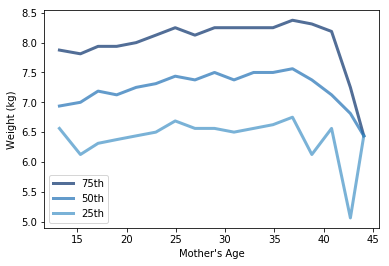

[Think Stats Chapter 7 Exercise 1](http://greenteapress.com/thinkstats2/html/thinkstats2008.html#toc70) (weight vs. age)

>> There is a weak correlation between mother's age and birth weight. The scatterplot shows no relationship; the darkest points create a nearly horizontal line. The plot of mother's age vs. percentiles of birth weight also doesn't show much of a relationship overall, but there is maybe a small correlation when the mother's age is between 15 and 25. The Pearson and Spearman's correlations are also very small, suggesting no correlation. Pearson's correlation coefficient is 0.07, and Spearman's is 0.09, suggesting some effect of outliers or a non-linear relationship. Below is the code from the jupyter notebook I used to solve the problem.

## Exercises

Using data from the NSFG, make a scatter plot of birth weight versus mother’s age. Plot percentiles of birth weight versus mother’s age. Compute Pearson’s and Spearman’s correlations. How would you characterize the relationship between these variables?


```python
import first

live, firsts, others = first.MakeFrames()
live = live.dropna(subset=['agepreg', 'totalwgt_lb'])
```


```python
age = live.agepreg
weights = live.totalwgt_lb
thinkplot.Scatter(age, weights, alpha=0.1, s=10)
thinkplot.Config(xlabel="Mother's Age",
                 ylabel='Weight (kg)',
                 legend=False)
```





```python
bins = np.arange(14, 46, 2)
indices = np.digitize(age, bins)
groups = live.groupby(indices)
mean_age = [group.agepreg.mean() for i, group in groups]
cdfs = [thinkstats2.Cdf(group.totalwgt_lb) for i, group in groups]
for percent in [75, 50, 25]:
    weight_percentiles = [cdf.Percentile(percent) for cdf in cdfs]
    label = '%dth' % percent
    thinkplot.Plot(mean_age, weight_percentiles, label=label)
    
thinkplot.Config(xlabel="Mother's Age",
                 ylabel='Weight (kg)',
                 legend=True)
```





```python
age.corr(weights, method='pearson')
```


    0.068833970354109097


```python
age.corr(weights, method='spearman')
```


    0.094610041096582262
