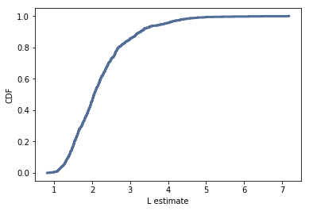
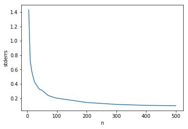

[Think Stats Chapter 8 Exercise 2](http://greenteapress.com/thinkstats2/html/thinkstats2009.html#toc77) (scoring)

>> As *n* increases, the standard error of the sample decreases.

## Exercises

**Exercise:** Suppose you draw a sample with size n=10 from an exponential distribution with λ=2. Simulate this experiment 1000 times and plot the sampling distribution of the estimate L. Compute the standard error of the estimate and the 90% confidence interval.

Repeat the experiment with a few different values of `n` and make a plot of standard error versus `n`.


```python
def Estimate4(n=10, iters=1000):
    lam = 2

    means = []
    for _ in range(iters):
        xs = np.random.exponential(1.0/lam, n)
        L = 1 / np.mean(xs)
        means.append(L)

    cdf = thinkstats2.Cdf(means)
    thinkplot.Cdf(cdf)
    thinkplot.Config(xlabel='L estimate', ylabel='CDF')
    
    print('rmse L', RMSE(means, lam))
    print('conf interval', (cdf.Percentile(5), cdf.Percentile(95)))
    return means
    
Ls = Estimate4()

```

    rmse L 0.840067046974
    conf interval (1.2434575876723206, 3.8821095363407765)





```python
import matplotlib.pyplot as plt

ns = [5,10,15,20,25,30,40,50,60,70,80,90,100,200,300,400,500]
def Estimate5(n, iters=1000):
    lam = 2

    means = []
    for _ in range(iters):
        xs = np.random.exponential(1.0/lam, n)
        L = 1 / np.mean(xs)
        means.append(L)
    
    return RMSE(means, lam)

rmses = [Estimate5(x) for x in ns]
plt.plot(ns, rmses)
plt.ylabel('stderrs')
plt.xlabel('n')
```


    <matplotlib.text.Text at 0x11fd3ab70>



